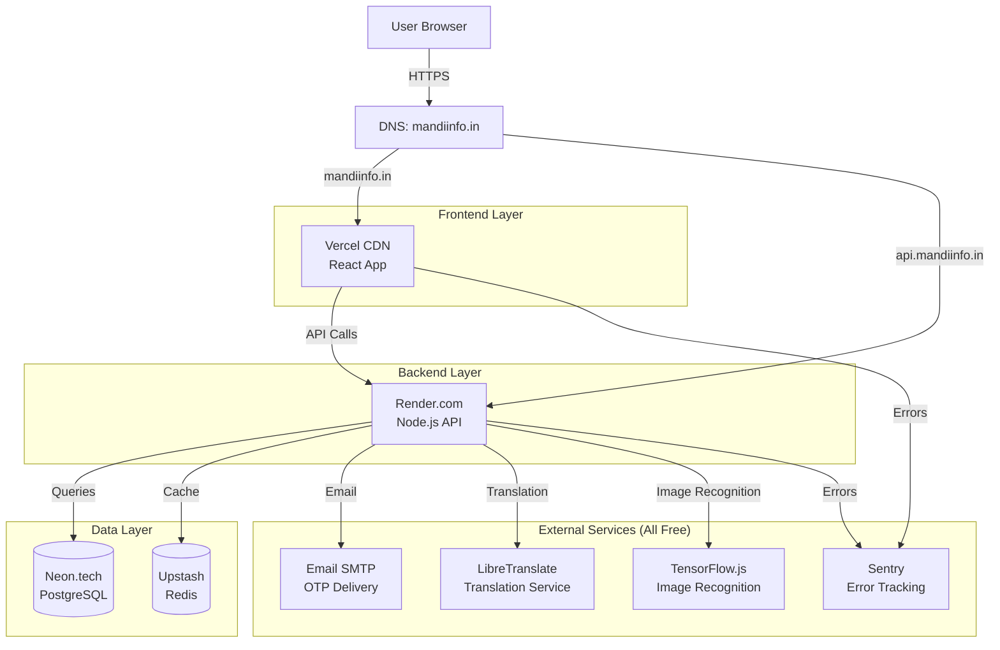
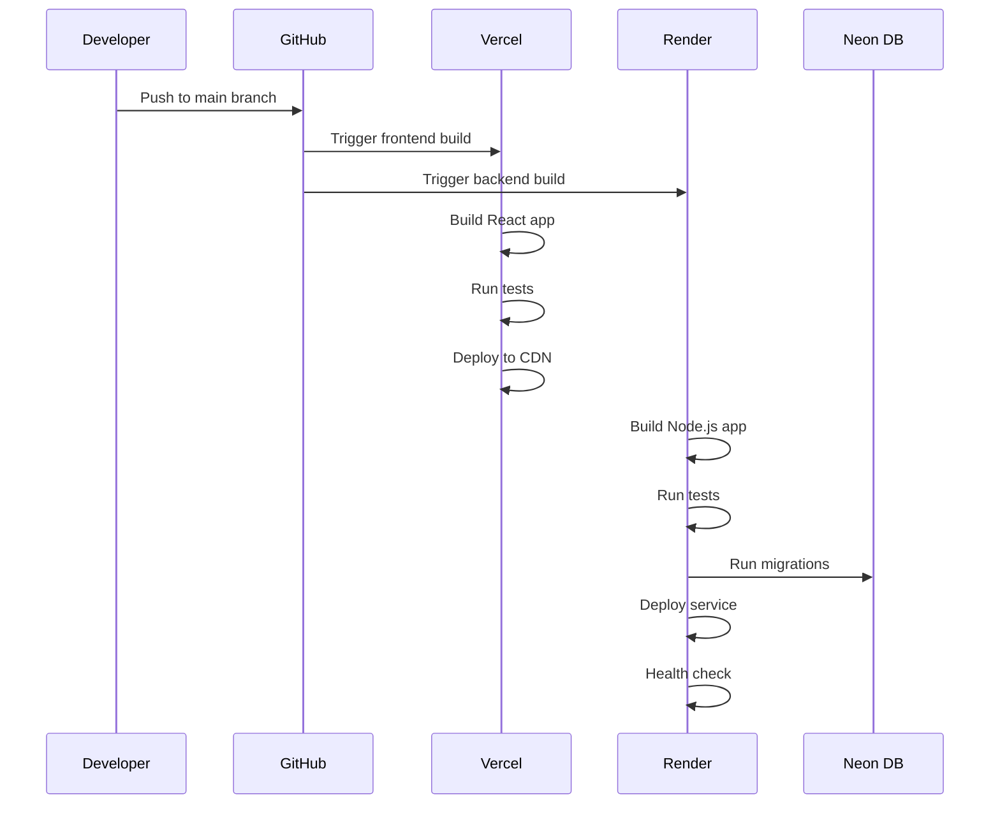

# Design Document: Production Deployment

## Overview

This design document outlines the architecture and implementation strategy for deploying the Multilingual Mandi web application to production on the domain mandiinfo.in with zero budget constraints. The deployment leverages free-tier services from multiple cloud providers to create a robust, scalable production environment.

The deployment architecture follows a distributed approach:
- **Frontend**: Static React application hosted on Vercel
- **Backend**: Node.js/Express API hosted on Render.com
- **Database**: PostgreSQL hosted on Neon.tech
- **Cache**: Redis hosted on Upstash
- **Domain**: mandiinfo.in with DNS configured for both frontend and backend
- **Monitoring**: Sentry for error tracking (free tier)

This design ensures the application can handle production traffic while staying within free-tier limits through careful resource management and optimization strategies.

## Architecture

### High-Level Architecture Diagram



### Deployment Flow



## Components and Interfaces

### 1. Frontend Hosting (Vercel)

**Service**: Vercel Free Tier
**URL**: https://mandiinfo.in

**Configuration**:
- Build command: `npm run build --workspace=frontend`
- Output directory: `packages/frontend/dist`
- Node version: 18.x or higher
- Environment variables: `VITE_API_URL=https://api.mandiinfo.in`

**Free Tier Limits** (based on [Vercel documentation](https://vercel.com/docs/limits/overview)):
- 100 GB bandwidth per month
- 100,000 serverless function invocations per month
- Unlimited static deployments
- Automatic HTTPS with SSL certificates
- Global CDN distribution

**Optimization Strategies**:
- Enable gzip/brotli compression
- Implement code splitting for routes
- Lazy load images and non-critical components
- Configure aggressive caching headers for static assets
- Use Vercel's Image Optimization (within free limits)

**DNS Configuration**:
```
Type: A
Name: @
Value: 76.76.21.21 (Vercel IP)

Type: CNAME
Name: www
Value: cname.vercel-dns.com
```

### 2. Backend API Hosting (Render.com)

**Service**: Render.com Free Tier
**URL**: https://api.mandiinfo.in

**Configuration**:
- Build command: `npm run build --workspace=backend`
- Start command: `npm run migrate && npm start --workspace=backend`
- Node version: 18.x or higher
- Health check path: `/api/health`
- Auto-deploy: Enabled on main branch

**Free Tier Limits** (based on [Render documentation](https://render.com/docs/free)):
- 750 hours per month (shared across all free services)
- 512 MB RAM
- 0.1 CPU
- Spins down after 15 minutes of inactivity
- Spins up automatically on new requests (cold start ~30 seconds)
- 100 GB bandwidth per month

**Cold Start Mitigation**:
- Implement a cron job (external service like cron-job.org) to ping health endpoint every 14 minutes
- Display loading state in frontend during cold starts
- Cache frequently accessed data in Redis

**Environment Variables**:
```
NODE_ENV=production
PORT=10000
DATABASE_URL=<neon-connection-string>
REDIS_URL=<upstash-connection-string>
JWT_SECRET=<generated-secret>
JWT_EXPIRES_IN=7d
OTP_EXPIRY_MINUTES=10
SMTP_HOST=smtp.gmail.com
SMTP_PORT=587
SMTP_USER=<gmail-address>
SMTP_PASSWORD=<gmail-app-password>
SMTP_FROM=<sender-email>
LIBRETRANSLATE_URL=<libretranslate-service-url>
SENTRY_DSN=<sentry-dsn>
```

**DNS Configuration**:
```
Type: CNAME
Name: api
Value: <render-service-name>.onrender.com
```

### 3. Database Hosting (Neon.tech)

**Service**: Neon.tech Free Tier
**Connection**: PostgreSQL with SSL

**Configuration**:
- PostgreSQL version: 16
- Region: US East (closest to Render.com)
- Connection pooling: Enabled (PgBouncer)
- SSL mode: require

**Free Tier Limits** (based on [Neon documentation](https://neon.tech/docs/introduction/plans)):
- 0.5 GB storage per project (up to 5 GB across 10 projects)
- 100 compute hours per month
- Autoscaling: 0.25 - 2 CU (1-8 GB RAM)
- Automatic scale-to-zero after 5 minutes of inactivity
- Connection pooling: Up to 10,000 concurrent connections

**Connection String Format**:
```
postgresql://[user]:[password]@[host]/[database]?sslmode=require
```

**Migration Strategy**:
- Run migrations automatically on backend deployment
- Use transaction-based migrations for safety
- Keep migration scripts idempotent
- Store migration history in database

**Backup Strategy**:
- Neon provides automatic backups (7-day retention on free tier)
- Export critical data weekly using pg_dump
- Store exports in GitHub repository (encrypted)

### 4. Redis Cache Hosting (Upstash)

**Service**: Upstash Redis Free Tier
**Connection**: Redis with TLS

**Configuration**:
- Redis version: 7.x
- Region: US East (closest to Render.com)
- TLS: Enabled
- Eviction policy: allkeys-lru (Least Recently Used)

**Free Tier Limits** (based on [Upstash documentation](https://upstash.com/docs/redis/overall/pricing)):
- 10,000 commands per day
- 100 MB storage
- 10,000 concurrent connections
- 200 GB bandwidth per month (free)

**Connection String Format**:
```
rediss://:[password]@[host]:[port]
```

**Caching Strategy**:
- Translation cache: 24-hour TTL
- OTP codes: 10-minute TTL
- Session data: 7-day TTL
- Product data: 1-hour TTL
- Price suggestions: 30-minute TTL

**Graceful Degradation**:
- Backend continues operating if Redis is unavailable
- Cache misses fall back to database queries
- Log cache failures for monitoring

### 5. Domain Configuration

**Domain**: mandiinfo.in (already owned)
**DNS Provider**: Domain registrar's DNS or Cloudflare (free)

**DNS Records**:
```
# Frontend (Vercel)
Type: A
Name: @
Value: 76.76.21.21
TTL: 3600

Type: CNAME
Name: www
Value: cname.vercel-dns.com
TTL: 3600

# Backend (Render)
Type: CNAME
Name: api
Value: <service-name>.onrender.com
TTL: 3600

# Email (if needed)
Type: MX
Name: @
Value: [mail-server]
Priority: 10
TTL: 3600
```

**SSL/TLS Certificates**:
- Vercel: Automatic SSL via Let's Encrypt
- Render: Automatic SSL via Let's Encrypt
- Both services handle certificate renewal automatically

### 6. Error Tracking and Monitoring

**Service**: Sentry Free Tier
**Integration**: Frontend and Backend

**Free Tier Limits**:
- 5,000 errors per month
- 1 project
- 1 team member
- 30-day error retention

**Configuration**:

Frontend (React):
```typescript
import * as Sentry from "@sentry/react";

Sentry.init({
  dsn: process.env.VITE_SENTRY_DSN,
  environment: "production",
  tracesSampleRate: 0.1, // 10% of transactions
  beforeSend(event) {
    // Filter out sensitive data
    return event;
  }
});
```

Backend (Node.js):
```typescript
import * as Sentry from "@sentry/node";

Sentry.init({
  dsn: process.env.SENTRY_DSN,
  environment: "production",
  tracesSampleRate: 0.1,
  beforeSend(event) {
    // Filter out sensitive data
    return event;
  }
});
```

**Health Check Endpoint**:
```typescript
// GET /api/health
{
  status: "healthy" | "degraded" | "unhealthy",
  timestamp: "2026-01-29T12:00:00Z",
  services: {
    database: "connected" | "disconnected",
    redis: "connected" | "disconnected",
    external: {
      twilio: "available" | "unavailable",
      google: "available" | "unavailable"
    }
  },
  uptime: 3600, // seconds
  memory: {
    used: 256, // MB
    total: 512 // MB
  }
}
```

### 7. External Services Configuration

**SMS/OTP Service**:
- **Primary Option**: Email-based OTP (completely free using SMTP)
  - Use Gmail SMTP (free for low volume)
  - Or use SendGrid free tier (100 emails/day)
  - Or use Mailgun free tier (5,000 emails/month)
- **Alternative**: Twilio trial ($15 credit, ~2,000 SMS) - NOT RECOMMENDED for zero budget
- **Recommendation**: Implement email-based OTP for production to maintain zero cost

**Translation Service**:
- **Primary Option**: LibreTranslate (free, open-source, self-hosted)
  - Can be deployed on Render.com free tier as a separate service
  - Supports 30+ languages including Hindi and regional Indian languages
- **Alternative**: Google Cloud Translation API ($20/month free credit) - requires credit card
- **Recommendation**: Use LibreTranslate for zero-cost translation

**Image Recognition Service**:
- **Primary Option**: TensorFlow.js with pre-trained models (completely free)
  - MobileNet for image classification
  - Runs in browser or on backend
  - No API costs
- **Alternative**: Google Cloud Vision API (1,000 units/month free) - requires credit card
- **Recommendation**: Use TensorFlow.js for zero-cost image recognition

**Cost Monitoring**:
- All services are completely free with no credit card required
- Monitor resource usage to stay within free-tier limits
- Implement rate limiting to prevent abuse
- Cache translations aggressively to reduce compute load

## Data Models

### Environment Configuration Schema

```typescript
interface ProductionConfig {
  // Server
  nodeEnv: 'production';
  port: number;
  
  // Database
  databaseUrl: string;
  dbPoolMax: number;
  dbIdleTimeout: number;
  dbConnectionTimeout: number;
  
  // Redis
  redisUrl: string;
  redisTls: boolean;
  
  // Authentication
  jwtSecret: string;
  jwtExpiresIn: string;
  otpExpiryMinutes: number;
  
  // External Services (All Free)
  smtp: {
    host: string;
    port: number;
    user: string;
    password: string;
    from: string;
  };
  libreTranslate: {
    url: string;
  };
  
  // Monitoring
  sentryDsn: string;
  
  // Feature Flags
  features: {
    enableOtpEmail: boolean;
    enablePhotoRecognition: boolean;
    enableTranslation: boolean;
  };
}
```

### Deployment Metadata

```typescript
interface DeploymentInfo {
  version: string; // Git commit SHA
  deployedAt: Date;
  deployedBy: string;
  environment: 'production' | 'staging';
  services: {
    frontend: {
      url: string;
      provider: 'vercel';
      status: 'active' | 'inactive';
    };
    backend: {
      url: string;
      provider: 'render';
      status: 'active' | 'inactive';
    };
    database: {
      provider: 'neon';
      region: string;
      status: 'active' | 'inactive';
    };
    cache: {
      provider: 'upstash';
      region: string;
      status: 'active' | 'inactive';
    };
  };
}
```

## Correctness Properties

*A property is a characteristic or behavior that should hold true across all valid executions of a system—essentially, a formal statement about what the system should do. Properties serve as the bridge between human-readable specifications and machine-verifiable correctness guarantees.*


### Property Reflection

After analyzing all acceptance criteria, I identified 35 testable criteria. Now reviewing for redundancy:

**Redundancy Analysis**:
- Properties 2.2 (HTTPS endpoints), 5.5 (HTTP to HTTPS redirect), and 6.3 (enforce HTTPS) all test HTTPS enforcement - can be combined into one comprehensive property
- Properties 3.2 (database SSL) and 12.5 (database SSL/TLS) are duplicate - combine into one
- Properties 4.2 (Redis TLS) and 4.3 (Redis connection pooling) are separate concerns - keep both
- Properties 7.3 (specific env vars) and 7.5 (validate env vars) can be combined - validation includes checking specific vars
- Properties 10.2 (error capture) and 10.4 (unhandled errors) are related but distinct - keep both
- Properties 11.2 (cache headers) and 11.3 (compression) are separate concerns - keep both

**Final Property Count**: 30 unique testable properties after consolidation

### Correctness Properties

Property 1: Build Optimization Verification
*For any* production build, the generated artifacts should include code splitting (multiple JS chunks) and minification (reduced file sizes compared to development build)
**Validates: Requirements 1.2**

Property 2: Compression Headers
*For any* static asset response, the response headers should include Content-Encoding: gzip or Content-Encoding: br
**Validates: Requirements 1.5, 11.3**

Property 3: HTTPS Enforcement
*For any* HTTP request to the frontend or backend, the system should either serve over HTTPS or redirect to HTTPS
**Validates: Requirements 2.2, 5.5, 6.3**

Property 4: Production Environment Configuration
*For any* backend instance, the NODE_ENV environment variable should be set to "production"
**Validates: Requirements 2.6**

Property 5: Database SSL Connection
*For any* database connection, the connection should use SSL/TLS encryption
**Validates: Requirements 3.2, 12.5**

Property 6: Database Migrations Applied
*For any* production database, all migration files should have corresponding entries in the migrations table
**Validates: Requirements 3.3**

Property 7: Database Connection Pool Limits
*For any* database connection pool configuration, the maximum connections should not exceed 20 (free-tier limit)
**Validates: Requirements 3.5**

Property 8: Redis TLS Connection
*For any* Redis connection, the connection should use TLS encryption (rediss:// protocol)
**Validates: Requirements 4.2**

Property 9: Redis Connection Pooling
*For any* Redis client configuration, connection pooling should be enabled with appropriate limits
**Validates: Requirements 4.3**

Property 10: Redis Graceful Degradation
*For any* Redis connection failure, the backend should continue operating and log the failure without crashing
**Validates: Requirements 4.4**

Property 11: Redis Eviction Policy
*For any* Redis instance, the eviction policy should be set to allkeys-lru or similar memory-efficient policy
**Validates: Requirements 4.5**

Property 12: TLS Version Enforcement
*For any* HTTPS connection, the minimum TLS version should be 1.2 or higher
**Validates: Requirements 6.4**

Property 13: Environment Variables Loaded
*For any* backend startup, all required environment variables (DATABASE_URL, REDIS_URL, JWT_SECRET, etc.) should be loaded and accessible
**Validates: Requirements 7.2, 7.3, 7.5**

Property 14: Environment Variables Not in Git
*For any* Git repository state, .env files should be listed in .gitignore and not tracked
**Validates: Requirements 7.4**

Property 15: Health Check Endpoint Exists
*For any* backend instance, the /api/health endpoint should return a 200 status with service connectivity information
**Validates: Requirements 9.1, 9.2**

Property 16: Health Check Failure Logging
*For any* health check failure, the failure should be logged with timestamp and error details
**Validates: Requirements 9.5**

Property 17: Error Tracking Integration
*For any* unhandled error in frontend or backend, the error should be captured with stack trace and sent to error tracking service
**Validates: Requirements 10.2, 10.4**

Property 18: Request ID in Logs
*For any* log entry, the log should include a unique request ID for tracing
**Validates: Requirements 10.5**

Property 19: Cache Headers for Static Assets
*For any* static asset response, appropriate cache-control headers should be set (e.g., max-age for immutable assets)
**Validates: Requirements 11.2**

Property 20: Service Worker Registration
*For any* frontend load, the service worker should be registered and active for offline functionality
**Validates: Requirements 11.5**

Property 21: Security Headers Present
*For any* HTTP response, security headers (CSP, X-Frame-Options, X-Content-Type-Options, HSTS) should be present
**Validates: Requirements 12.1**

Property 22: CORS Configuration
*For any* API request, CORS headers should allow only specified origins (frontend domain)
**Validates: Requirements 12.2**

Property 23: Rate Limiting Enforcement
*For any* API endpoint, rate limiting should be enforced (e.g., max 100 requests per minute per IP)
**Validates: Requirements 12.3**

Property 24: Missing Credentials Graceful Handling
*For any* external service with missing credentials, the system should disable the feature gracefully and log a warning without crashing
**Validates: Requirements 16.4**

Property 25: Database Seeding Script Exists
*For any* production deployment, a database seeding script should exist and execute successfully
**Validates: Requirements 17.1**

Property 26: Seeded Data Present
*For any* freshly seeded database, product categories and common products should exist in the database
**Validates: Requirements 17.3**

Property 27: Seeding Idempotency
*For any* database state, running the seeding script multiple times should not duplicate data or cause errors
**Validates: Requirements 17.4**

Property 28: Seeding Operations Logged
*For any* seeding operation, the operation should be logged with details of what was seeded
**Validates: Requirements 17.5**

## Error Handling

### Frontend Error Handling

**Network Errors**:
- Display user-friendly error messages for network failures
- Implement retry logic with exponential backoff
- Cache failed requests for retry when connection is restored
- Show offline indicator when backend is unreachable

**API Errors**:
- Handle 4xx errors with specific user guidance
- Handle 5xx errors with generic error message and retry option
- Log all errors to Sentry with user context
- Implement error boundaries to prevent full app crashes

**Cold Start Handling**:
- Display loading state during backend cold starts (~30 seconds)
- Show estimated wait time to users
- Implement timeout after 60 seconds with retry option

### Backend Error Handling

**Database Errors**:
- Catch connection errors and retry with exponential backoff
- Log all database errors with query context
- Return 503 Service Unavailable if database is down
- Implement circuit breaker pattern for repeated failures

**Redis Errors**:
- Continue operation without cache if Redis is unavailable
- Log cache failures for monitoring
- Fall back to database queries on cache misses
- Don't crash on Redis connection errors

**External Service Errors**:
- Implement timeout for all external API calls (5 seconds)
- Retry failed requests up to 3 times with exponential backoff
- Gracefully degrade features if external services are unavailable
- Log all external service failures

**Validation Errors**:
- Return 400 Bad Request with detailed error messages
- Sanitize error messages to avoid exposing sensitive information
- Log validation failures for security monitoring

**Authentication Errors**:
- Return 401 Unauthorized for invalid tokens
- Return 403 Forbidden for insufficient permissions
- Clear invalid tokens from client storage
- Log authentication failures for security monitoring

### Error Response Format

```typescript
interface ErrorResponse {
  error: {
    code: string; // e.g., "DATABASE_CONNECTION_ERROR"
    message: string; // User-friendly message
    details?: any; // Additional context (only in development)
    requestId: string; // For tracing
    timestamp: string;
  };
}
```

## Testing Strategy

### Deployment Verification Tests

**Purpose**: Verify that the production deployment is configured correctly and all services are operational.

**Test Categories**:

1. **Infrastructure Tests** (Run after deployment):
   - Verify frontend is accessible at https://mandiinfo.in
   - Verify backend is accessible at https://api.mandiinfo.in
   - Verify SSL certificates are valid and not expired
   - Verify DNS records are configured correctly
   - Verify health check endpoint returns healthy status

2. **Configuration Tests** (Run after deployment):
   - Verify all environment variables are set
   - Verify NODE_ENV is "production"
   - Verify database connection uses SSL
   - Verify Redis connection uses TLS
   - Verify database migrations are applied
   - Verify connection pool limits are configured

3. **Security Tests** (Run after deployment):
   - Verify HTTPS is enforced (HTTP redirects to HTTPS)
   - Verify TLS 1.2+ is enforced
   - Verify security headers are present
   - Verify CORS is configured correctly
   - Verify rate limiting is enforced
   - Verify .env files are not in Git

4. **Performance Tests** (Run periodically):
   - Verify frontend loads in under 2 seconds on 3G
   - Verify API responses are under 5 seconds
   - Verify compression is enabled
   - Verify cache headers are set correctly
   - Verify service worker is registered

5. **Error Handling Tests** (Run after deployment):
   - Verify errors are captured by Sentry
   - Verify health check failures are logged
   - Verify Redis failures don't crash backend
   - Verify missing credentials are handled gracefully
   - Verify request IDs are in logs

6. **Data Tests** (Run after deployment):
   - Verify database seeding completed successfully
   - Verify seeded data is present
   - Verify seeding is idempotent

### Testing Tools

**Automated Testing**:
- **Playwright**: End-to-end tests for critical user flows
- **Jest/Vitest**: Unit tests for configuration validation
- **Supertest**: API endpoint tests
- **Lighthouse CI**: Performance and accessibility testing

**Manual Testing**:
- **SSL Labs**: SSL/TLS configuration testing
- **Security Headers**: Security header validation
- **GTmetrix**: Performance testing
- **Postman**: API endpoint testing

### Test Execution Schedule

**Pre-Deployment**:
- Run all unit tests
- Run all integration tests
- Run Lighthouse performance tests
- Review security checklist

**Post-Deployment**:
- Run infrastructure tests (verify all services are up)
- Run configuration tests (verify all settings are correct)
- Run security tests (verify security measures are in place)
- Run smoke tests (verify critical user flows work)

**Ongoing**:
- Run performance tests weekly
- Run security scans monthly
- Monitor error rates daily via Sentry
- Monitor resource usage daily

### Rollback Testing

**Rollback Procedure**:
1. Identify the issue (via monitoring or user reports)
2. Determine if rollback is necessary
3. Initiate rollback via hosting provider dashboard
4. Verify previous version is deployed
5. Run smoke tests to verify functionality
6. Monitor error rates for 1 hour
7. Document the incident and root cause

**Rollback Test**:
- Perform a test rollback in staging environment
- Verify rollback completes within 5 minutes
- Verify database state is preserved
- Verify no data loss occurs
- Document the rollback procedure

## Deployment Checklist

### Pre-Deployment

- [ ] All tests passing in CI/CD
- [ ] Code reviewed and approved
- [ ] Environment variables documented
- [ ] Database migrations tested
- [ ] Backup of current database taken
- [ ] Rollback procedure documented
- [ ] Monitoring and alerting configured

### Deployment Steps

**1. Database Setup (Neon.tech)**:
- [ ] Create Neon.tech account
- [ ] Create new PostgreSQL database
- [ ] Copy connection string
- [ ] Enable SSL mode
- [ ] Configure connection pooling
- [ ] Test connection from local machine

**2. Redis Setup (Upstash)**:
- [ ] Create Upstash account
- [ ] Create new Redis database
- [ ] Copy connection string (rediss://)
- [ ] Configure eviction policy (allkeys-lru)
- [ ] Test connection from local machine

**3. Backend Deployment (Render.com)**:
- [ ] Create Render.com account
- [ ] Create new Web Service
- [ ] Connect GitHub repository
- [ ] Configure build command: `npm run build --workspace=backend`
- [ ] Configure start command: `npm run migrate && npm start --workspace=backend`
- [ ] Set environment variables (DATABASE_URL, REDIS_URL, etc.)
- [ ] Configure health check path: `/api/health`
- [ ] Enable auto-deploy on main branch
- [ ] Trigger initial deployment
- [ ] Verify deployment successful
- [ ] Test health check endpoint

**4. Frontend Deployment (Vercel)**:
- [ ] Create Vercel account
- [ ] Import GitHub repository
- [ ] Configure root directory: `packages/frontend`
- [ ] Configure build command: `npm run build --workspace=frontend`
- [ ] Configure output directory: `dist`
- [ ] Set environment variable: `VITE_API_URL=https://api.mandiinfo.in`
- [ ] Enable auto-deploy on main branch
- [ ] Trigger initial deployment
- [ ] Verify deployment successful

**5. Domain Configuration**:
- [ ] Add custom domain in Vercel: `mandiinfo.in`
- [ ] Add custom domain in Vercel: `www.mandiinfo.in`
- [ ] Add custom domain in Render: `api.mandiinfo.in`
- [ ] Configure DNS records at domain registrar
- [ ] Wait for DNS propagation (up to 24 hours)
- [ ] Verify domains resolve correctly
- [ ] Verify SSL certificates are issued

**6. External Services (All Free)**:
- [ ] Configure Gmail SMTP for email OTP (or SendGrid/Mailgun free tier)
- [ ] Deploy LibreTranslate service on Render.com free tier
- [ ] Configure TensorFlow.js for image recognition
- [ ] Test external service integrations
- [ ] No billing alerts needed (all services are free)

**7. Monitoring Setup**:
- [ ] Create Sentry account
- [ ] Create new project for frontend
- [ ] Create new project for backend
- [ ] Copy DSN keys
- [ ] Configure Sentry in frontend
- [ ] Configure Sentry in backend
- [ ] Test error tracking
- [ ] Set up alert rules

**8. Database Seeding**:
- [ ] Run database migrations
- [ ] Run seeding script
- [ ] Verify seeded data in database
- [ ] Test seeding idempotency

### Post-Deployment Verification

- [ ] Frontend accessible at https://mandiinfo.in
- [ ] Backend accessible at https://api.mandiinfo.in
- [ ] Health check returns healthy status
- [ ] SSL certificates valid
- [ ] HTTPS enforced (HTTP redirects)
- [ ] Security headers present
- [ ] CORS configured correctly
- [ ] Rate limiting working
- [ ] Error tracking working
- [ ] Database connection working
- [ ] Redis connection working
- [ ] External services working
- [ ] Critical user flows working
- [ ] Performance acceptable (Lighthouse score > 80)

### Monitoring and Maintenance

- [ ] Set up uptime monitoring (e.g., UptimeRobot)
- [ ] Configure cold start mitigation (cron job to ping every 14 minutes)
- [ ] Monitor resource usage daily
- [ ] Review error logs daily
- [ ] Review performance metrics weekly
- [ ] Test backup restoration monthly
- [ ] Review and update documentation as needed

## Cost Management

### Free Tier Limits Summary

| Service | Limit | Monitoring Strategy |
|---------|-------|---------------------|
| Vercel | 100 GB bandwidth/month | Monitor via Vercel dashboard |
| Render | 750 hours/month, 100 GB bandwidth | Monitor via Render dashboard |
| Neon | 0.5 GB storage, 100 compute hours | Monitor via Neon dashboard |
| Upstash | 10,000 commands/day, 100 MB storage | Monitor via Upstash dashboard |
| Sentry | 5,000 errors/month | Monitor via Sentry dashboard |
| Gmail SMTP | 500 emails/day (free) | Monitor email sending logs |
| SendGrid | 100 emails/day (free tier) | Monitor via SendGrid dashboard |
| LibreTranslate | Self-hosted on Render free tier | Monitor via Render dashboard |
| TensorFlow.js | Client-side, no limits | No monitoring needed |

### Cost Optimization Strategies

**Bandwidth Optimization**:
- Enable compression for all responses
- Implement aggressive caching
- Optimize images (WebP format, lazy loading)
- Use CDN caching effectively
- Minimize API payload sizes

**Compute Optimization**:
- Implement cold start mitigation (keep backend warm)
- Optimize database queries (use indexes)
- Cache frequently accessed data in Redis
- Implement request batching where possible

**Storage Optimization**:
- Regularly clean up old data
- Compress stored data where possible
- Use Redis for temporary data only
- Implement data retention policies

**API Call Optimization**:
- Cache translations aggressively (24-hour TTL)
- Batch translation requests to LibreTranslate
- Implement rate limiting to prevent abuse
- Use TensorFlow.js client-side to avoid backend load
- Use email OTP instead of SMS to eliminate costs

### Scaling Beyond Free Tier

If the application exceeds free-tier limits, consider these options:

1. **Optimize First**: Implement all cost optimization strategies
2. **Upgrade Selectively**: Upgrade only the service hitting limits
3. **Alternative Services**: Consider switching to other free-tier providers
4. **Monetization**: Implement revenue generation to cover costs
5. **Community Support**: Seek sponsorship or donations

## Documentation

### Deployment Guide

A comprehensive deployment guide will be created in `DEPLOYMENT.md` covering:
- Step-by-step deployment instructions
- Environment variable configuration
- DNS setup instructions
- Troubleshooting common issues
- Rollback procedures
- Monitoring and maintenance

### Environment Variables Documentation

All environment variables will be documented in `.env.example` with:
- Variable name
- Description
- Required/Optional
- Default value
- Example value
- Which service requires it

### Architecture Documentation

Architecture diagrams and documentation will be maintained in:
- `ARCHITECTURE.md`: High-level architecture overview
- `SERVICES.md`: Detailed service configurations
- `API.md`: API endpoint documentation
- `MONITORING.md`: Monitoring and alerting setup

### Runbook

A runbook will be created in `RUNBOOK.md` covering:
- Common issues and solutions
- Emergency procedures
- Rollback procedures
- Backup and restoration
- Performance optimization
- Security incident response

## Security Considerations

### Authentication and Authorization

- JWT tokens with 7-day expiration
- Secure token storage (httpOnly cookies or secure localStorage)
- Token refresh mechanism
- Rate limiting on authentication endpoints
- OTP expiration (10 minutes)

### Data Protection

- All connections use SSL/TLS
- Database connections use SSL
- Redis connections use TLS
- Passwords hashed with bcrypt
- Sensitive data encrypted at rest (if applicable)

### Input Validation

- All user inputs sanitized
- SQL injection prevention (parameterized queries)
- XSS prevention (input sanitization, CSP headers)
- CSRF protection (SameSite cookies)
- File upload validation (type, size, content)

### Security Headers

```
Content-Security-Policy: default-src 'self'; script-src 'self' 'unsafe-inline'; style-src 'self' 'unsafe-inline'
X-Frame-Options: DENY
X-Content-Type-Options: nosniff
Strict-Transport-Security: max-age=31536000; includeSubDomains
X-XSS-Protection: 1; mode=block
Referrer-Policy: strict-origin-when-cross-origin
```

### Rate Limiting

- Authentication endpoints: 5 requests per minute per IP
- API endpoints: 100 requests per minute per IP
- File upload endpoints: 10 requests per hour per user
- Search endpoints: 30 requests per minute per IP

### Monitoring and Alerting

- Monitor failed authentication attempts
- Alert on unusual traffic patterns
- Monitor error rates
- Alert on service downtime
- Monitor resource usage
- Alert on approaching free-tier limits

## Performance Optimization

### Frontend Optimization

- Code splitting by route
- Lazy loading for images and components
- Tree shaking to remove unused code
- Minification and compression
- Service worker for offline caching
- Preloading critical resources
- Font optimization (subset fonts)
- Image optimization (WebP, responsive images)

### Backend Optimization

- Database query optimization (indexes, query planning)
- Redis caching for frequently accessed data
- Connection pooling for database and Redis
- Response compression (gzip/brotli)
- API response caching
- Batch processing for bulk operations
- Async processing for non-critical tasks

### Database Optimization

- Proper indexing on frequently queried columns
- Query optimization (avoid N+1 queries)
- Connection pooling
- Read replicas for read-heavy workloads (if needed)
- Materialized views for complex queries (if needed)

### Caching Strategy

**Cache Layers**:
1. Browser cache (static assets)
2. CDN cache (Vercel CDN)
3. Application cache (Redis)
4. Database query cache

**Cache TTLs**:
- Static assets: 1 year (immutable)
- API responses: 5 minutes (frequently changing)
- Translations: 24 hours (rarely changing)
- User sessions: 7 days
- OTP codes: 10 minutes

## Conclusion

This design provides a comprehensive deployment strategy for the Multilingual Mandi application using free-tier services. The architecture is designed to be cost-effective, scalable, and maintainable while meeting all production requirements.

Key success factors:
- Careful resource management to stay within free-tier limits
- Robust error handling and monitoring
- Performance optimization for low-bandwidth networks
- Security best practices
- Comprehensive documentation and runbooks

The deployment can be completed within the 4-day timeline by following the deployment checklist and leveraging automated deployment pipelines provided by Vercel and Render.com.
